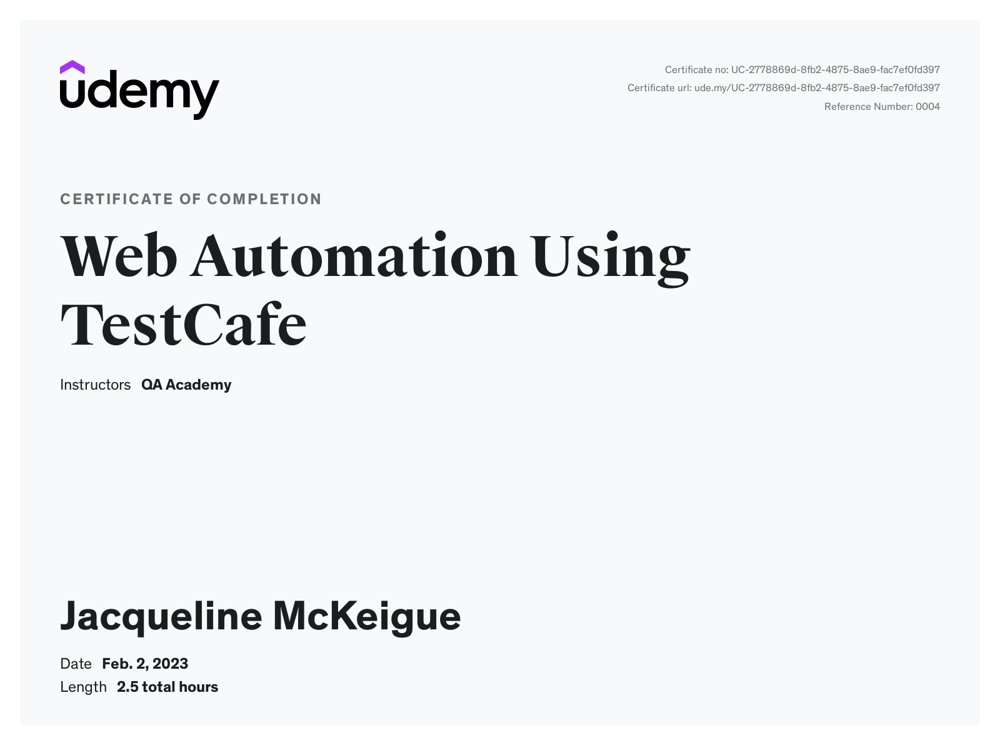
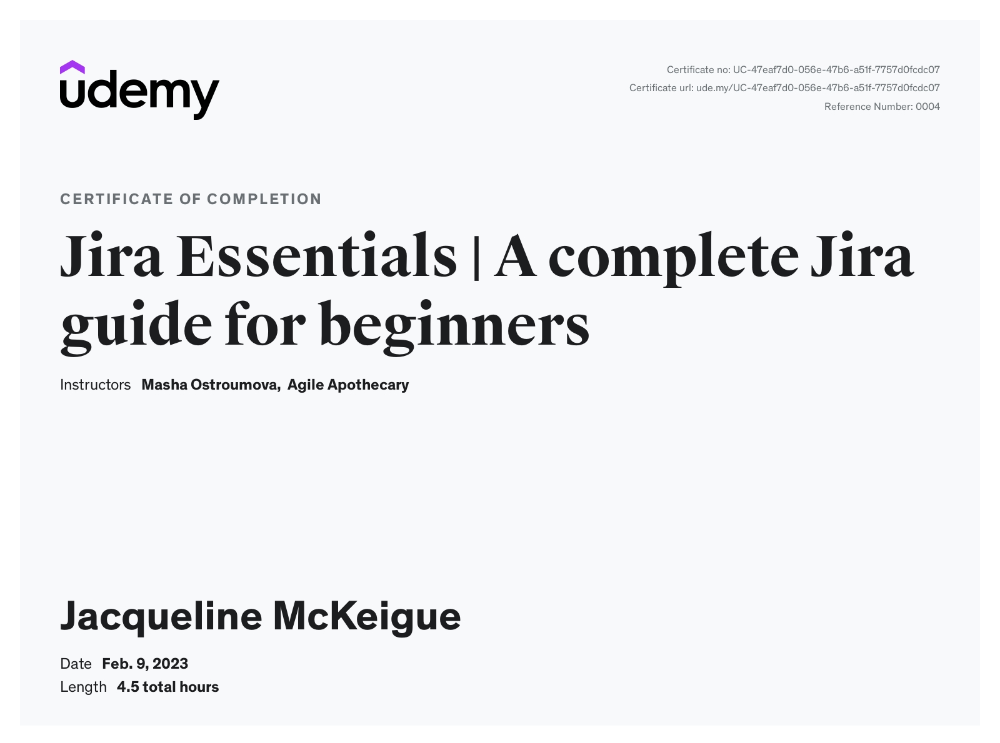

### 👋 Hi, I’m Dr Jac and I love organisation in code, music, and weaving.
### 👀 For over 17 years, I've enjoyed a music portfolio career as violinist, teacher, composer (PhD), and conductor.
### 🌱 I’m a junior software engineer enthusiastically learning as much as possible about JavaScript, Typescript, React, React Native, React Hook Form, Zod, HTML, SCSS, CSS, Tailwind, Node.js, Next.js, Axios, Koa Router, Java, Spring Boot, Jenkins, Docker, Kubernetes, DynamoDB, PostgresSQL, Swagger, Postman, ESLint, Husky.
### In my current role I am a committed accessibility ally.
### In my spare time I walk, weave, make music, and enjoy Scottish dancing.

 

### [Repository containing all Digital Futures Assessed Work](https://github.com/JacDoesJS/Digital-Futures)
### [Pre-Academy projects](https://github.com/JacDoesJS/pre-Academy-work)
### [Academy Full Stack Team Engineering Project](https://github.com/SE-group-3-group-project)
(There are two READMEs for our team engineering project: one in the frontend and one in the backend folder.)
 
 

#          "Am I testing my code, or is it testing me?"
 

#### 💞️ I’m looking to collaborate with other coders of any level.
#### 📫 How to reach me https://jacdoesjavascript.wordpress.com  and jac.mckeigue@outlook.com
 

### while training with Digital Futures Academy, I also took these additional courses

 
### I also love doing the challenges on Codewars - https://www.codewars.com/users/JacMcK/badges/large
 

### latest upskilling certificates

I made my banner with guidance from... https://leviarista.github.io/github-profile-header-generator/

<!---
JacDoesJS/JacDoesJS is a ✨ special ✨ repository because its `README.md` (this file) appears on your GitHub profile.
You can click the Preview link to take a look at your changes.
--->
