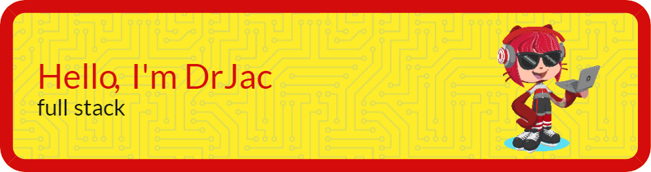
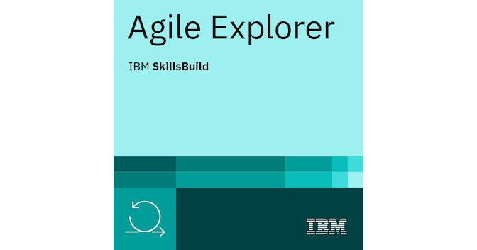

### 👋 Hi, I’m Dr Jac, and I started learning to code seriously in January 2022 and I absolutely love it!
### 👀 For over 17 years, I've enjoyed a music portfolio career as violinist, teacher, composer (PhD), and conductor.
### 🌱 I’m a trainee software engineer enthusiastically learning as much as possible about JavaScript, React, node.js, Java, HTML, CSS (tailwind & bootstrap) and PHP in my spare time.

## [Repository containing all Digital Futures Assessed Work](https://github.com/JacDoesJS/Digital-Futures)
## [pre-Academy projects](https://github.com/JacDoesJS/pre-Academy-work)
## [Academy Full Stack Team Engineering Project](https://github.com/SE-group-3-group-project)
The README for team engineering project is in the Frontend folder.
 
### I love doing the challenges on Codewars - https://www.codewars.com/users/JacMcK/badges/large

#          "Am I testing my code, or is it testing me?"

#### 💞️ I’m looking to collaborate with other intermediate coders.
#### 📫 How to reach me https://jacdoesjavascript.wordpress.com  and jac.mckeigue@outlook.com
 

### while training with Digital Futures Academy, I also took these additional courses

#### make your own banner here...
https://leviarista.github.io/github-profile-header-generator/

<!---
JacDoesJS/JacDoesJS is a ✨ special ✨ repository because its `README.md` (this file) appears on your GitHub profile.
You can click the Preview link to take a look at your changes.
--->
