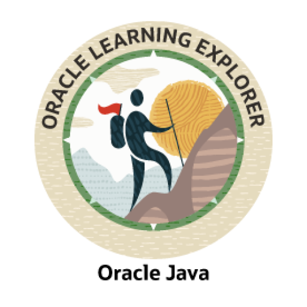

### 👋 Hi, I’m Dr Jac and I love organisation in code, music, and weaving.
### 👀 Front-end Developer, Accessibilty Advocate, and general encourager of communication, whether that's better documentation, more useful error messages, or just ditching the acronyms.
### 🎻 For over 17 years, I enjoyed a music portfolio career as violinist, teacher, composer (PhD), and conductor.
### 🌱 I enjoy working with and learning about, Javascript, Typescript, React, React Native, Python, HTML, SCSS, CSS, Tailwind, Node.js, Next.js, Java, Spring Boot, Jenkins, Docker, Kubernetes. 

### In my spare time I walk, weave, make music, enjoy Scottish dancing - and write more code.

 

#          "Am I testing my code, or is it testing me?"
 

#### 💞️ I’m looking to collaborate with other coders of any level.
#### 📫 How to reach me - jac.mckeigue@outlook.com
 

### while training with Digital Futures Academy, I also took these additional courses

 

I made my banner with guidance from... https://leviarista.github.io/github-profile-header-generator/

<!---
JacDoesJS/JacDoesJS is a ✨ special ✨ repository because its `README.md` (this file) appears on your GitHub profile.
You can click the Preview link to take a look at your changes.
--->
